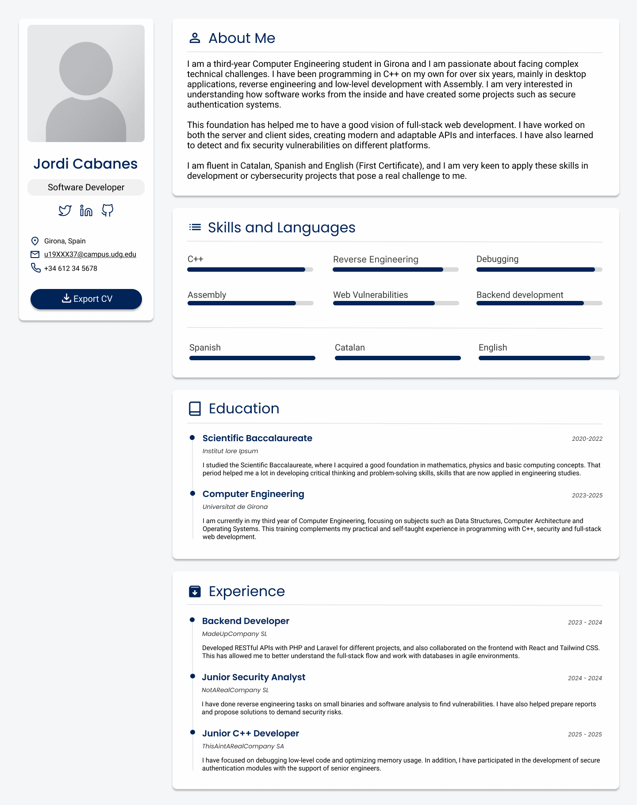

# Hypermedia project Part 1 - Web Curriculum Vitae

## Important Notes

**Privacy and Fictional Data:** To protect privacy, some CV information is fictional. However, sections such as *About Me*, *Skills*, and *Education* reflect real information too, while contact details and work experience have been modified/redacted.

**Course Content Compliance:** I've made sure to use only HTML and CSS concepts covered in class for this project. Even though I have experience with techniques outside the course material, I've tried to limit myself to what we've learned to demonstrate proper understanding of that (there are a few minor details, like `box-shadow`, that i think weren't explicitly covered in class but were necessary to achieve the desired design).

**Design Fidelity**: The design isn't meant to be an exact replica of the Figma prototype. Some visual elements, like the icons, are different, since in Figma I used assets from the library and here I decided to go with Font Awesome for consistency and easier implementation.

**Use of Artificial Intelligence:** AI was used in this project to translate and polish some texts, especially to ensure smoother and more coherent writing.

## Project Analysis

### User Persona:

**Name:** Laia Costa  
**Age:** 37 years old  
**Position:** Head of Human Resources at a technology company in Badalona  
**Objective:** To find candidates for a junior developer position with knowledge of C++ and computer security

**Use Case:**  
Laia reviews many resumes each week. She needs to quickly access candidates technical skills, experience, and education. She particularly values resumes that present information clearly and modernly, as this demonstrates digital competence. She usually reviews resumes on her office laptop, but sometimes does so on her tablet/mobile when working from home.

**Requirements for her:**
- Quickly locate technical skills
- View work experience with a clear timeline
- Easily access contact information
- Design that scales well across different screens

---

### Information Architecture

The website follows a **two-column layout** designed to optimize the space and maintain a clear visual hierarchy. The entire layout is **centered in a container** with a maximum width of 1200px instead of spanning the full width of the page, which improves readability and creates a more focused, professional appearance, especially on larger screens.

The **left column**, which is fixed, displays all personal information: the photo, name, professional title, social media links, contact details, and a button to download the resume (figma design in this case) as a image. This **sticky design** ensures that the contact information is always visible, which is very convenient for the user.

The **right column** organizes the main content into four thematic blocks. First, the *About Me* section presents a personal introduction and professional objectives. Then, *Skills and Languages* displays technical competencies and languages using progress bars that provide an intuitive visual representation. The *Education* section shows academic background in a timeline format with circular dots and a vertical connecting line to show it in chronological order. Finally, *Experience* presents work history using the same timeline pattern as before. Each card acts as a module with consistent internal spacing, making the content easy to read.

This was not a requirement, but I decided to make the website kind of responsive. When viewed on smaller devices, the layout automatically switches to a single column. The personal section is shown first, followed by the entire professional section. The skills grids are reduced from a three-column format to a single column, maintaining readability. It is not perfect, but it's pretty decent.

---

### Visual Design

The color palette is based on a **dark blue** that gives trust and professionalism, combined with neutral tones like white and gray. The light gray background helps reduce eye strain and makes the white cards stand out. Blue is strategically used throughout the design to create hierarchy and draw attention to important elements, from section headers and interactive components to visual indicators like skill bars and timeline markers. This consistent use of the primary color creates a visual identity.

For **typography**, I used two Google Fonts imported from their API: *Poppins* for headings and accent elements, and *Roboto* for body text. Both are sans-serif and offer very good readability on screen. Playing with different weights (400, 500, and 600) allows for a clear hierarchy without overwhelming the overall design. Section titles use *Poppins medium*, job titles/degrees are in *semi-bold*, and descriptions are in *Roboto regular*. 

For **icons**, I chose to use Font Awesome imported from their CDN rather than downloading the icons from Figma and importing them locally, it's more convenient, keeps the design consistent, and looks more professional without managing separate files. The icons are used for social media links, contact information, section headers, and the download button, enhancing visual communication throughout the CV.

The layout, built with **Grid** and **Flexbox**, offers flexibility and a modern look. The cards have rounded corners and a soft shadow that adds depth without being too obvious. The timeline with dots and vertical connections helps to understand the chronological order in a simple way. Finally, generous spacing (padding, margins, and gap) makes it easy to process.

## Website Link

[antonposamun10.site](https://antonposamun10.site) *(I hope you appreciate the domain name I just bought only for this project 🤣)*

**Backup URL:** [justacoderlol.github.io](https://justacoderlol.github.io) *(in case the main one doesn't work for some reason)*

## Figma Project Link

[View prototype the website is based on](https://www.figma.com/design/17GfYa0s13QJH3xlPWELPX/CV-Website?node-id=0-1&t=o0oU5nMoKFLIECm3-1)

**Note:** The link is view-only. I haven't enabled editing permissions because this repository is public. If you (Anton) need edit access, please send me an email.

